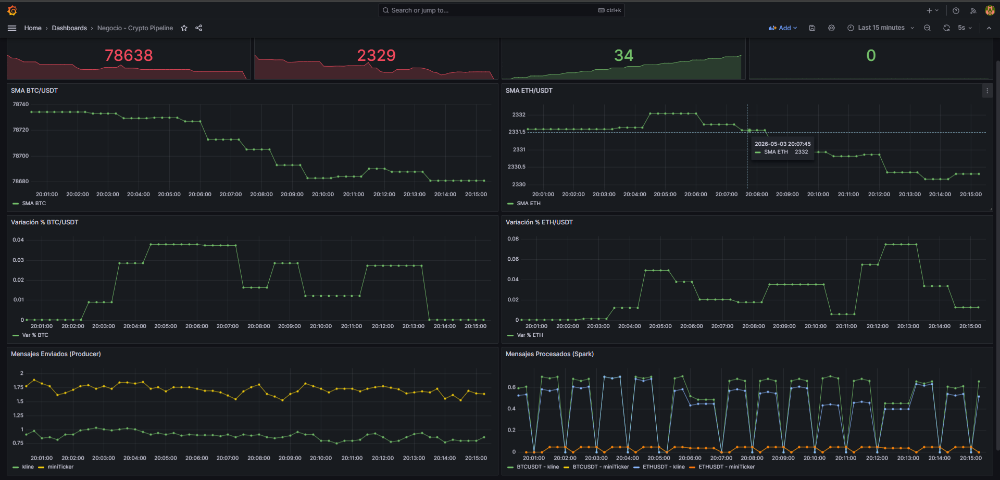

# CryptoExchange Pipeline v1.0

Sistema completo de ingesta, procesamiento y visualización de datos del mercado de criptomonedas en tiempo real.

**Stack:** Binance WebSocket → Kafka → Spark Structured Streaming → HDFS (Parquet) + Grafana (tiempo real)



## Arquitectura

```
┌─────────────┐     ┌─────────────┐     ┌─────────────────┐     ┌─────────────┐
│ Binance WS  │────▶│    Kafka    │────▶│ Spark Streaming │────▶│    HDFS     │
│(@miniTicker │     │  (Topics)   │     │ (Indicadores +  │     │  (Parquet   │
│ @kline_1m)  │     │             │     │  ventanas)      │     │  particion) │
└─────────────┘     └─────────────┘     └─────────────────┘     └─────────────┘
                                                │
                                                ▼
                                        ┌─────────────┐
                                        │ Prometheus  │
                                        │ + Grafana   │
                                        │ (Métricas   │
                                        │  infra +    │
                                        │  negocio)   │
                                        └─────────────┘
```

- **Fuentes:** Binance WebSocket (@miniTicker, @kline_1m) — BTC/USDT + ETH/USDT
- **Ingesta:** Apache Kafka (Confluent 7.5)
- **Procesamiento:** Apache Spark 3.5 Structured Streaming
- **Almacenamiento:** HDFS 3.2 (Parquet, particionado por par/fecha)
- **Observabilidad:** Prometheus + Grafana + Node Exporter + cAdvisor
- **Catálogo:** Hive 4.0 (tablas externas sobre Parquet)

## Requisitos

- Docker >= 24.0
- Docker Compose >= 2.20
- 8 GB RAM mínimo recomendado
- Conexión a Internet (para streams de Binance y descarga de paquetes Spark)

## Estructura

```
.
├── docker-compose.yml          # Orquestación completa del clúster
├── .env                        # Variables de entorno globales
├── producer/                   # Productor Python (Binance → Kafka)
│   ├── Dockerfile
│   ├── binance_producer.py
│   └── requirements.txt
├── spark/                      # Job Spark Structured Streaming
│   ├── Dockerfile
│   └── crypto_streaming.py
├── hdfs/                       # Configuración Hadoop
│   └── hadoop.env
├── hive/                       # Configuración Hive + scripts HQL
│   ├── conf/
│   ├── init_tables.hql
│   └── entrypoint.sh
├── prometheus/                 # Configuración Prometheus + alertas
│   ├── prometheus.yml
│   └── alert_rules.yml
├── grafana/                    # Dashboards y provisioning
│   ├── dashboards/
│   └── provisioning/
├── scripts/                    # Scripts de utilidad
│   └── test_kafka.py
├── docs/                       # Documentación de memoria y decisiones de diseño
│   └── Memoria_Tecnica_CryptoExchange_FadouaHathouti
│   └── decisiones_diseno.md
│   └── Proyecto_Final_CryptoExchange_v1.0.pdf  #enunciado
└── README.md                   # Este archivo
```

## Uso Rápido

### 1. Levantar el clúster completo

```bash
docker compose up -d
```

> **Nota:** El primer arranque descarga imágenes y paquetes Maven para Spark (puede tardar 3-5 min).

### 2. Verificar estado de los servicios

```bash
docker compose ps
```

Todos los contenedores deben mostrar `Up` o `healthy`.

### 3. Accesos

| Servicio | URL | Credenciales |
|----------|-----|--------------|
| Kafka (externo) | `localhost:9094` | — |
| HDFS NameNode UI | http://localhost:9870 | — |
| Spark Master UI | http://localhost:8080 | — |
| Spark Streaming metrics | http://localhost:8001/metrics | — |
| Prometheus | http://localhost:9090 | — |
| Grafana | http://localhost:3000 | admin / admin |
| HiveServer2 (Beeline) | `jdbc:hive2://localhost:10000` | — |
| Portainer | http://localhost:9000 | Crear usuario al primer acceso |
| cAdvisor | http://localhost:8081 | — |

### 4. Validar pipeline

```bash
# Ver topics Kafka
docker exec kafka kafka-topics --bootstrap-server localhost:9092 --list

# Ver métricas del producer
curl -s http://localhost:8000/metrics | grep crypto_precio_actual

# Ver métricas de Spark
curl -s http://localhost:8001/metrics | grep crypto_precio_sma

# Ver datos en HDFS
docker exec namenode hdfs dfs -ls -R /data/cripto

# Consultas Hive (desde contenedor)
docker exec -i hive /opt/hive/bin/beeline -u jdbc:hive2://localhost:10000 -e "SELECT * FROM cripto_mini LIMIT 5;"
```

### 5. Parar el clúster

```bash
docker compose down
```

> Para borrar también los volúmenes (pierde histórico HDFS): `docker compose down -v`

## Decisiones de Diseño (Resumen)

| Aspecto | Decisión | Justificación |
|---------|----------|---------------|
| Topics Kafka | Un topic por tipo de dato (`miniTicker`, `kline`) | Escalable, separación de responsabilidades |
| Formato HDFS | Parquet (snappy) | Columnar, comprimido, nativo Spark/Hive |
| Particionado HDFS | `par=XXX/fecha=YYYY-MM-DD` | Filtrado eficiente por par sin escanear todo el histórico |
| Replicación HDFS | 1 | Clúster local de 1 nodo; replicar 3x no aporta tolerancia |
| Ventanas Spark | 2 min / 30 seg (demo local) | Equilibrio entre reactividad y validación rápida. En producción real: 5 min / 1 min |
| Pares | BTC/USDT + ETH/USDT | Máxima liquidez y estabilidad |
| Dashboards Grafana | 2 separados (infra / negocio) | La rúbrica valora la diferenciación de capas |
| Alertas | 3 configuradas | Umbral + duración + severidad justificados |

La justificación completa de cada decisión se encuentra en [`docs/decisiones_diseno.md`](docs/decisiones_diseno.md).

## Estado del Proyecto

- [x] Fase 0: Scaffold y entorno
- [x] Fase 1: Kafka operativo
- [x] Fase 2: Productor Binance
- [x] Fase 3: Spark Streaming
- [x] Fase 4: HDFS + Hive
- [x] Fase 5: Observabilidad completa
- [x] Fase 6: Integración y documentación

## Notas para la Memoria y la Defensa

### Métricas de negocio expuestas (≥3)
1. `crypto_precio_actual{par, tipo_stream}` — Precio en vivo desde el producer
2. `pipeline_mensajes_enviados_total{topic}` — Throughput del producer
3. `crypto_precio_sma{par}` — SMA calculada por Spark
4. `crypto_variacion_pct{par}` — Volatilidad intra-ventana
5. `pipeline_mensajes_procesados_total{par, topic}` — Throughput de Spark
6. `spark_batches_procesados_total` — Salud del job de streaming

### Alertas configuradas (≥1)
- **ProducerDown:** `up == 0` durante >1min → critical
- **NoMessagesProcessed:** `rate(mensajes_procesados[2m]) == 0` durante >2min → warning
- **HighPriceVariation:** `variacion_pct > 5%` durante >30s → critical

### Demo en vivo (5 min)
1. Mostrar `docker compose up -d` (ya estará levantado)
2. Ver Grafana → dashboard Negocio con precios en vivo
3. Ver Prometheus → targets UP, alertas inactive
4. Ver HDFS NameNode UI → archivos Parquet creciendo
5. Ejecutar query Hive/Spark SQL sobre histórico

## Autor

Fadoua Hathouti Lahrech

Proyecto Final — CryptoExchange 
